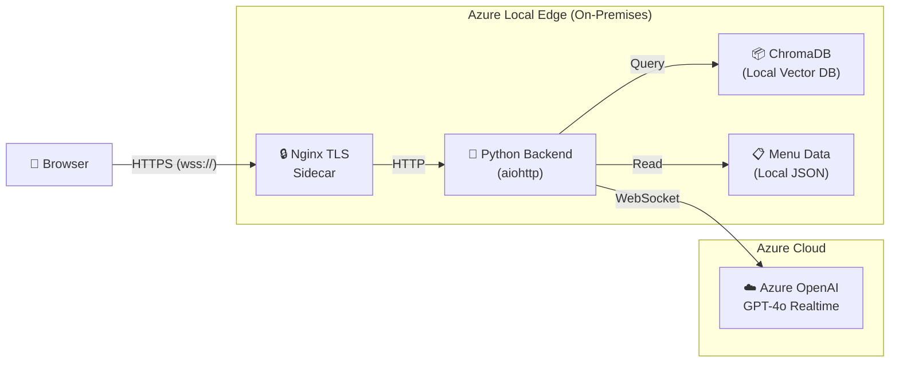

# Dunkin Voice Chat Assistant — Hybrid-Edge Deployment

> **Live demo:** <https://dunkin.adaptivecloudlab.com>

A Dunkin' Donuts voice ordering assistant running as a **Hybrid-Edge Deployment** on Azure Local. Voice and AI reasoning happen in the cloud via Azure OpenAI GPT-4o Realtime, while menu search runs locally at the edge using ChromaDB with ONNX embeddings — no cloud dependency for menu data.

| Layer | Technology | Location |
|-------|-----------|----------|
| **Voice / AI** | Azure OpenAI GPT-4o Realtime API (STT + reasoning + TTS in one streaming WebSocket, sub-second latency) | Cloud |
| **Menu Search** | ChromaDB vector database with ONNX MiniLM-L6-v2 embeddings, baked into the container | Edge |
| **Infrastructure** | AKS Arc on Azure Local (on-premises Kubernetes) | Edge |
| **GitOps** | Flux v2 — syncs deployment manifests from GitHub | Edge |
| **Container** | Optimized 383 MB slim image (down from 8.9 GB original) | Edge |

## Table of Contents

- [Architecture](#architecture)
- [Features](#features)
- [Upstream Acknowledgment](#upstream-acknowledgment)
- [Hybrid vs. Fully-Local Mode](#hybrid-vs-fully-local-mode)
- [Getting Started](#getting-started)
- [Running the App Locally](#running-the-app-locally)
- [Deploying to Azure Local (Edge)](#deploying-to-azure-local-edge)
- [Demo Guide](#demo-guide)
- [Contributing](#contributing)
- [Resources](#resources)

## Architecture



**Data flow:** The browser opens a WebSocket over HTTPS (terminated by an nginx TLS sidecar). The Python backend streams audio bi-directionally with Azure OpenAI's Realtime API for speech-to-text, reasoning, and text-to-speech. When the model needs menu information it calls a tool function; the backend queries ChromaDB locally and returns results — menu data never leaves the edge.

## Features

- **Real-time voice ordering**: GPT-4o Realtime handles STT → reasoning → TTS in a single streaming connection with ~200 ms latency.
- **Local menu search (RAG)**: ChromaDB with ONNX MiniLM-L6-v2 embeddings provides semantic search over the Dunkin' menu entirely at the edge.
- **Tool calling**: The model uses function calling to search the menu, add/remove items, and calculate order totals.
- **Live order synchronization**: Function calls update a shared cart so the order panel stays in sync.
- **Multilingual support**: Real-time transcription and translation across English, Spanish, Mandarin, French, and more.
- **Drive-through UX**: Designed for kiosk, curbside, and drive-thru ordering flows.

## Upstream Acknowledgment

This is a fork of [swigerb/dunkin-chat-voice-assistant](https://github.com/swigerb/dunkin-chat-voice-assistant), which extends the [VoiceRAG pattern](https://github.com/Azure-Samples/aisearch-openai-rag-audio) ([blog post](https://aka.ms/voicerag)). Special thanks to [John Carroll](https://github.com/john-carroll-sw) for the original [coffee-chat-voice-assistant](https://github.com/john-carroll-sw/coffee-chat-voice-assistant).

This fork ([mgodfre3/dunkin-chat-voice-assistant](https://github.com/mgodfre3/dunkin-chat-voice-assistant)) replaces Azure AI Search with a local ChromaDB instance, optimizes the container image, and adds Kubernetes manifests for AKS Arc on Azure Local with Flux GitOps.

## Hybrid vs. Fully-Local Mode

The `USE_LOCAL_PIPELINE` environment variable toggles between two modes:

| Mode | `USE_LOCAL_PIPELINE` | Voice Pipeline | Menu Search | Latency |
|------|---------------------|---------------|-------------|---------|
| **Hybrid (default)** | `false` | Azure OpenAI Realtime (cloud) | ChromaDB (local) | ~200 ms |
| **Fully-local** | `true` | Foundry Local + Whisper + Piper TTS (edge) | ChromaDB (local) | ~10–20 s |

The hybrid mode is recommended for production. The fully-local mode is available for air-gapped scenarios but has significantly higher latency due to edge compute constraints.

## Getting Started

### Prerequisites

- Python ≥ 3.11
- Node.js (for frontend build)
- Docker (for container builds)
- An Azure OpenAI resource with a GPT-4o Realtime deployment

### Quick Start

1. Clone this repository:

   ```bash
   git clone https://github.com/mgodfre3/dunkin-chat-voice-assistant.git
   cd dunkin-chat-voice-assistant
   ```

2. Copy and fill in environment variables:

   ```bash
   cp app/backend/.env-sample app/backend/.env
   # Edit app/backend/.env with your Azure OpenAI credentials
   ```

3. Start the app:

   ```bash
   # Linux/Mac
   ./scripts/start.sh

   # Windows
   pwsh .\scripts\start.ps1
   ```

4. Open <http://localhost:8000>.

## Running the App Locally

### Direct Execution

See [Quick Start](#quick-start) above.

### Docker

```bash
# Build the optimized image
docker build -t dunkin-voice-assistant -f ./app/Dockerfile ./app

# Run with your environment
docker run -p 8000:8000 --env-file ./app/backend/.env dunkin-voice-assistant:latest
```

Or use the convenience script:

```bash
chmod +x ./scripts/docker-build.sh
./scripts/docker-build.sh
```

## Deploying to Azure Local (Edge)

This repository includes Kubernetes manifests and Flux configuration for deploying to AKS Arc on Azure Local:

- **`k8s/`** — Kubernetes deployment, service, and ingress manifests
- **`flux/`** — Flux v2 GitOps configuration (Kustomization, HelmRelease, etc.)

Flux watches this repository and automatically reconciles changes to the cluster. See [DEPLOY.md](DEPLOY.md) for detailed deployment instructions.

## Demo Guide

See [docs/demo-guide.md](docs/demo-guide.md) for a walkthrough of the live demo at <https://dunkin.adaptivecloudlab.com>.

## License

This project is licensed under the [MIT License](LICENSE).

## Contributing

Contributions are welcome! See [CONTRIBUTING.md](CONTRIBUTING.md) for details.

## Disclaimer

All trademarks and brand references belong to their respective owners.

The diagrams, images, and code samples in this repository are provided **AS IS** for **proof-of-concept and pilot purposes only** and are **not intended for production use**.

These materials are provided without warranty of any kind and **do not constitute an offer, commitment, or support obligation** on the part of Microsoft. Microsoft does not guarantee the accuracy or completeness of any information contained herein.

**MICROSOFT MAKES NO WARRANTIES, EXPRESS OR IMPLIED**, including but not limited to warranties of merchantability, fitness for a particular purpose, or non-infringement.

Use of these materials is at your own risk.

## Resources

- [OpenAI Realtime API Documentation](https://platform.openai.com/docs/guides/realtime)
- [Azure OpenAI Documentation](https://learn.microsoft.com/azure/ai-services/openai/)
- [Azure Local Documentation](https://learn.microsoft.com/azure/azure-local/)
- [AKS Arc Documentation](https://learn.microsoft.com/azure/aks/hybrid/)
- [Flux v2 Documentation](https://fluxcd.io/docs/)
- [ChromaDB Documentation](https://docs.trychroma.com/)
- [Azure Developer CLI Documentation](https://learn.microsoft.com/azure/developer/azure-developer-cli/)
