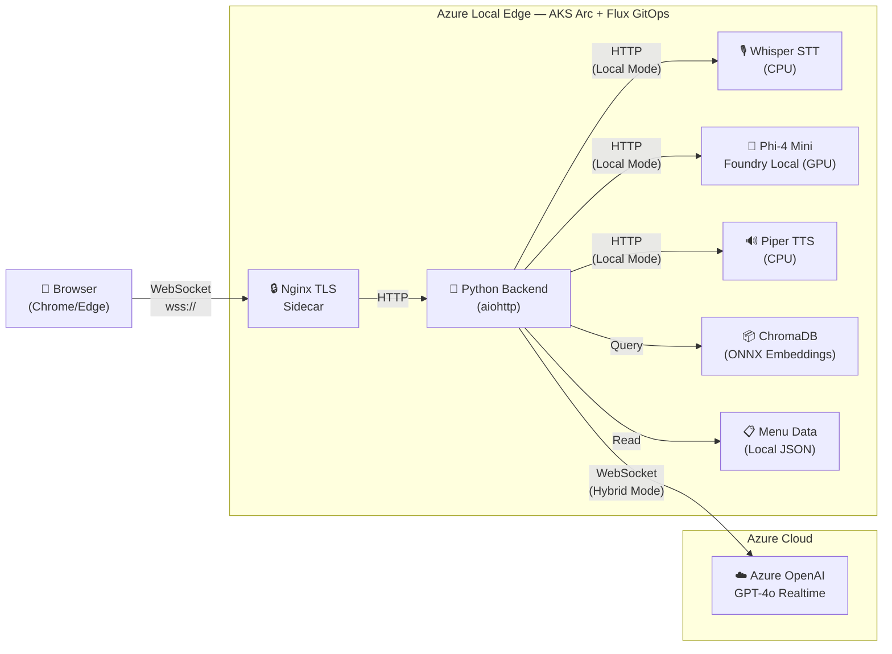

# Dunkin' AI Voice Ordering — 8-Minute Demo Script

**Audience:** Technical decision-makers, partners, internal stakeholders  
**Goal:** Show a real AI workload running at the edge on Azure Local, highlight Foundry Local, and make the case for why edge AI matters.

---

## [0:00 – 1:00] HOOK — The Problem & The Promise

> "Imagine you pull into a Dunkin' drive-through lane. You talk to the speaker. An AI takes your order — in your language — instantly. It knows the menu, it handles substitutions, and it does it all under 200 milliseconds.
>
> But here's the twist: the brains behind this aren't in a data center a thousand miles away. They're running on a server *in* the restaurant. That's what we're going to show you today.
>
> This is a real, working AI voice-ordering system deployed on Azure Local — Microsoft's on-premises infrastructure — using AKS Arc for Kubernetes, Foundry Local for local model inference, and GitOps for fully automated deployment. Let me walk you through it."

---

## [1:00 – 2:30] ARCHITECTURE OVERVIEW — What's Running Where

> *[Show the architecture diagram below or put it on-screen]*

>
> "Let's look at the architecture. There are two halves:
>
> **At the edge — on-premises Azure Local hardware — we're running:**
>
> - A Python backend on AKS Arc — that's managed Kubernetes running on Azure Local
> - ChromaDB — a local vector database with the entire Dunkin' menu embedded using ONNX MiniLM embeddings. Menu data never leaves the store.
> - An nginx TLS sidecar handling encrypted WebSocket connections from the browser
> - **Foundry Local** running Phi-4 Mini on a GPU, plus Whisper for speech-to-text and Piper for text-to-speech — a fully local AI pipeline
>
> **In the cloud — Azure OpenAI:**
>
> - GPT-4o Realtime API — this is the hybrid mode. It handles speech-to-text, reasoning, and text-to-speech in a single streaming WebSocket connection. Sub-second latency.
>
> The key insight: **we can toggle between hybrid mode and fully-local mode with a single environment variable.** In hybrid mode, voice goes through Azure OpenAI for the best quality. In fully-local mode, Foundry Local runs the entire pipeline on-prem — no cloud dependency at all. That's air-gapped capable.
>
> Both modes use the same local ChromaDB for menu search. **Your proprietary data — the menu, prices, availability — never leaves the edge.**"

---

## [2:30 – 4:30] LIVE DEMO — Voice Ordering in Action

> *[Open https://dunkin.adaptivecloudlab.com in Chrome/Edge. Open the Employee Dashboard (/crew) in a second tab side-by-side.]*
>
> "Let me show you this live. I'm going to the actual running application — dunkin.adaptivecloudlab.com. This is being served from an AKS Arc cluster running on Azure Local hardware in our lab.
>
> *[Click the orange microphone button]*
>
> Let me place an order.
>
> *[Speak naturally]*
>
> — 'Hey, good morning! Can I get a large iced coffee?'
>
> *[Wait for response — point out the real-time transcription, the order panel updating, and the spoken response]*
>
> Notice a few things: you can see the transcription happening in real time. The AI is searching the Dunkin' menu using ChromaDB locally — that tool call just happened at the edge. And it added the item to the order panel with the correct price.
>
> — 'Actually, can you recommend something for my friend who doesn't drink coffee?'
>
> *[AI responds with a recommendation — likely a refresher or juice]*
>
> — 'The apple juice sounds great. Also, we're hungry — what do you have for breakfast?'
>
> *[AI searches the menu again and suggests sandwiches]*
>
> — 'Let's do the bacon egg and cheese sandwich.'
>
> — 'That's everything. How much is the total?'
>
> *[AI reads back the order with the total]*
>
> Now look at the employee dashboard — *[switch to /crew tab]* — the crew sees the lane status, cars in queue, order details, all updating in real time via WebSocket. This is the operator view that would run on a tablet behind the counter."

---

## [4:30 – 5:30] FOUNDRY LOCAL — The Fully-Local Pipeline

> "Now let me talk about the fully-local mode — this is where Foundry Local comes in.
>
> By setting one environment variable — `USE_LOCAL_PIPELINE=true` — the entire AI pipeline switches to run on-prem:
>
> - **Whisper** handles speech-to-text — running on CPU in its own Kubernetes pod
> - **Phi-4 Mini via Foundry Local** handles the reasoning and tool-calling — running on GPU. This is deployed using the Foundry Local operator CRD — a `ModelDeployment` custom resource that declares the model, version, and compute type. Kubernetes manages the lifecycle.
> - **Piper TTS** converts the response back to speech
>
> All three are deployed as Kubernetes workloads via Flux GitOps — same as the main app.
>
> **Why does this matter?** Think about locations with unreliable connectivity. Military installations. Cruise ships. Remote retail. With Foundry Local, you get a production-quality SLM running entirely on your hardware. The trade-off today is latency — about 10 to 20 seconds per turn versus 200 milliseconds in hybrid mode — but the model quality is strong, and as edge hardware improves, that gap closes.
>
> The point is: **you have a choice.** Best quality with cloud, or full sovereignty with local. Same app, same codebase, one toggle."

---

## [5:30 – 6:30] EDGE ADVANTAGES — Why Run AI at the Edge?

> "So let me step back and explain *why* you'd want to run AI at the edge. There are five key reasons:
>
> 1. **Data sovereignty.** Menu data, pricing, customer preferences — they stay on-prem. For regulated industries — healthcare, defense, financial services — this is non-negotiable. Our menu search uses ChromaDB with ONNX embeddings baked right into the container image. No cloud call required.
>
> 2. **Latency.** When the AI is local, you eliminate the round-trip to a cloud region. For real-time voice interactions, every millisecond counts. A 200ms response feels instant. A 2-second response feels like the system is broken.
>
> 3. **Resilience.** If the internet goes down, the store doesn't stop. In fully-local mode, the entire pipeline keeps running. No cloud dependency means no single point of failure.
>
> 4. **Cost at scale.** Imagine 10,000 Dunkin' locations. Streaming every audio interaction to the cloud is expensive. Running inference locally on commodity hardware means your per-location cost drops dramatically as you scale.
>
> 5. **Compliance.** Some environments simply can't send data to the cloud — government, military, critical infrastructure. Edge AI with Foundry Local makes those deployments possible."

---

## [6:30 – 7:30] THE PLATFORM — Azure Local, AKS Arc, GitOps

> "Let me highlight the platform that makes this possible.
>
> **Azure Local** is Microsoft's on-premises cloud infrastructure. It gives you the same Azure services — compute, storage, networking — but running in your own facility. You manage it through the Azure portal.
>
> **AKS Arc** is managed Kubernetes on Azure Local. Our entire application — the Python backend, nginx, ChromaDB, Whisper, Phi-4 Mini, Piper TTS — it's all running as Kubernetes workloads on an AKS Arc cluster. We get health monitoring, rolling updates, secrets management — the same Kubernetes experience as AKS in the cloud.
>
> **Flux v2 GitOps** is how we deploy. When I push a change to GitHub — a new container image tag, a config change, a new model deployment — Flux detects it and reconciles the cluster automatically. No one is SSH-ing into servers. No manual kubectl commands. The Git repository *is* the source of truth.
>
> And the container image itself is optimized — **383 MB**, down from 8.9 GB in the original. It includes the pre-built ChromaDB vector index, the frontend assets, and all Python dependencies. Fast to pull, fast to start."

---

## [7:30 – 8:00] CLOSE — The Takeaway

> "So let me leave you with this.
>
> What we showed today is not a prototype or a concept. This is a **working AI application** — voice ordering, real-time RAG, tool calling, multi-language support — running on real edge hardware with Azure Local and AKS Arc.
>
> The key takeaways:
>
> - **Azure Local + AKS Arc** gives you cloud-native Kubernetes at the edge
> - **Foundry Local** puts production-quality SLMs on your own hardware — fully air-gapped if needed
> - **GitOps with Flux** makes deployment hands-off and repeatable across thousands of locations
> - And you get to **choose your trade-offs** — cloud AI for best quality, local AI for full sovereignty, or both in a hybrid model
>
> Edge AI isn't a future thing. It's running right now at dunkin.adaptivecloudlab.com. Thank you."

---

## Speaker Notes

### Before the demo
- Open Chrome/Edge with two tabs: guest experience + `/crew` employee dashboard
- Make sure microphone permissions are granted and audio is working
- Have the architecture diagram ready (Mermaid in README or a slide)
- Test the live site to confirm it's responsive

### Key talking points to hit if asked
| Question | Answer |
|----------|--------|
| Why not just use the cloud? | Latency, data sovereignty, resilience, cost at scale |
| How does Foundry Local compare to Azure OpenAI? | Same app code, different pipeline. Cloud = 200ms, best quality. Local = 10-20s, full sovereignty. |
| What's the SLM? | Phi-4 Mini Instruct via Foundry Local operator — GPU-accelerated, Kubernetes-native |
| How is this deployed? | Flux GitOps watches GitHub, auto-reconciles to AKS Arc cluster |
| What about the menu data? | ChromaDB + ONNX embeddings, baked into the container at build time. Never leaves edge. |
| Container size? | 383 MB optimized image (from 8.9 GB original) |
| Multi-language? | Yes — GPT-4o Realtime handles transcription and translation across English, Spanish, Mandarin, French, etc. |
