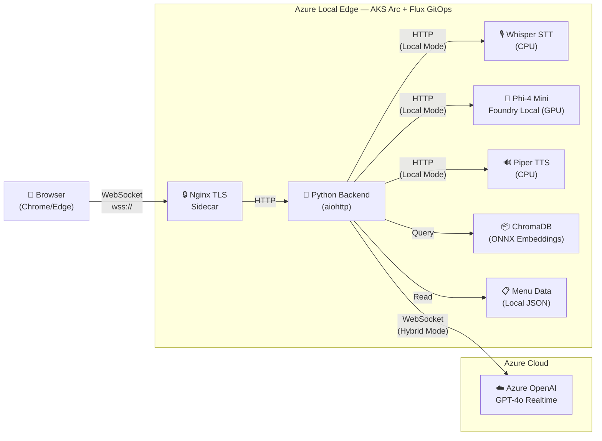

# Dunkin' AI Voice Ordering — 8-Minute Demo Script

**Audience:** Technical decision-makers, partners, internal stakeholders  
**Goal:** Show a real AI workload running at the edge on Azure Local, highlight **Foundry Local** as the key enabler for on-premises AI inference, and make the case for why edge AI matters.

---

> ### 💡 What Is Foundry Local?
>
> **Foundry Local** is Microsoft's framework for running AI models directly on your own hardware — no cloud connection required. It provides:
>
> - A **Kubernetes operator** that deploys models via a `ModelDeployment` custom resource (CRD) — you declare the model name, version, and compute type, and the operator handles pulling the model, scheduling it on GPU/CPU, and exposing an OpenAI-compatible API endpoint.
> - Access to the **Foundry model catalog** — curated, optimized models (like Phi-4 Mini) ready to run locally.
> - An **OpenAI-compatible REST API**, so your application code works identically whether it's calling Azure OpenAI in the cloud or Foundry Local on-prem.
>
> In this demo, Foundry Local runs **Phi-4 Mini Instruct** on a GPU inside our AKS Arc cluster. It handles all the AI reasoning — understanding what the customer said, deciding which tools to call (menu search, order updates), and generating the response — entirely at the edge.

---

## [0:00 – 1:00] HOOK — The Problem & The Promise

> "Imagine you pull into a Dunkin' drive-through lane. You talk to the speaker. An AI takes your order — in your language — instantly. It knows the menu, it handles substitutions, and it does it all in real time.
>
> But here's what makes this different: the AI model powering this isn't in Azure. It's running right here, on a server in the restaurant, using **Foundry Local** — Microsoft's framework for running AI models on your own hardware.
>
> We're going to show you a real, working AI voice-ordering system deployed on Azure Local with AKS Arc, where **Foundry Local runs Phi-4 Mini on a GPU at the edge** for AI reasoning, ChromaDB provides local menu search, and Flux GitOps handles automated deployment. No cloud dependency required. Let me walk you through it."

---

## [1:00 – 2:30] ARCHITECTURE OVERVIEW — What's Running Where

> *[Show the architecture diagram below or put it on-screen]*



>
> "Let's look at the architecture. There are two halves:
>
> **At the edge — on-premises Azure Local hardware — we're running:**
>
> - A Python backend on AKS Arc — that's managed Kubernetes running on Azure Local
> - ChromaDB — a local vector database with the entire Dunkin' menu embedded using ONNX MiniLM embeddings. Menu data never leaves the store.
> - An nginx TLS sidecar handling encrypted WebSocket connections from the browser
> - **Foundry Local running Phi-4 Mini Instruct on GPU** — this is the AI brain. It's deployed as a Kubernetes-native `ModelDeployment` CRD. You declare the model and compute type in YAML, apply it, and the Foundry Local operator handles everything — model download, GPU scheduling, health checks, and exposing an OpenAI-compatible API. Our app talks to it the same way it would talk to Azure OpenAI.
> - **Whisper** for speech-to-text and **Piper** for text-to-speech — both running as Kubernetes pods alongside the main app
>
> **In the cloud — Azure OpenAI:**
>
> - GPT-4o Realtime API — this is the hybrid mode. It handles speech-to-text, reasoning, and text-to-speech in a single streaming WebSocket connection. Sub-second latency.
>
> The key insight: **we can toggle between hybrid mode and fully-local mode with a single environment variable.** In hybrid mode, voice goes through Azure OpenAI for the best quality. In fully-local mode, Foundry Local runs the entire pipeline on-prem — no cloud dependency at all. That's air-gapped capable.
>
> Both modes use the same local ChromaDB for menu search. **Your proprietary data — the menu, prices, availability — never leaves the edge.**"

---

## [2:30 – 4:30] LIVE DEMO — Voice Ordering in Action

> *[Open https://dunkin.adaptivecloudlab.com in Chrome/Edge. Open the Employee Dashboard (/crew) in a second tab side-by-side.]*
>
> "Let me show you this live. I'm going to the actual running application — dunkin.adaptivecloudlab.com. This is being served from an AKS Arc cluster running on Azure Local hardware in our lab.
>
> *[Click the orange microphone button]*
>
> Let me place an order.
>
> *[Speak naturally]*
>
> — 'Hey, good morning! Can I get a large iced coffee?'
>
> *[Wait for response — point out the real-time transcription, the order panel updating, and the spoken response]*
>
> Notice a few things: you can see the transcription happening in real time. The AI is searching the Dunkin' menu using ChromaDB locally — that tool call just happened at the edge. And it added the item to the order panel with the correct price.
>
> — 'Actually, can you recommend something for my friend who doesn't drink coffee?'
>
> *[AI responds with a recommendation — likely a refresher or juice]*
>
> — 'The apple juice sounds great. Also, we're hungry — what do you have for breakfast?'
>
> *[AI searches the menu again and suggests sandwiches]*
>
> — 'Let's do the bacon egg and cheese sandwich.'
>
> — 'That's everything. How much is the total?'
>
> *[AI reads back the order with the total]*
>
> Now look at the employee dashboard — *[switch to /crew tab]* — the crew sees the lane status, cars in queue, order details, all updating in real time via WebSocket. This is the operator view that would run on a tablet behind the counter."

---

## [4:30 – 5:45] FOUNDRY LOCAL — The Star of the Show

> "Now let me dig into **Foundry Local**, because this is the heart of what makes this demo special.
>
> The question we started with was: *can you run a real AI workload entirely on-prem, with no cloud dependency?* Foundry Local is how we answered yes.
>
> **What Foundry Local does:** It's Microsoft's framework for running AI models on your own hardware. It gives you a Kubernetes operator that manages model lifecycle — you write a YAML manifest declaring which model you want, what compute it needs, and Foundry Local handles the rest: pulling the model from the catalog, scheduling it on GPU, running health checks, and exposing an OpenAI-compatible REST endpoint.
>
> *[Show or reference the Phi-4 Mini deployment YAML]*
>
> Here's what our deployment looks like — it's just 27 lines of YAML:
>
> ```yaml
> apiVersion: foundrylocal.azure.com/v1
> kind: ModelDeployment
> metadata:
>   name: phi-4-mini-gpu
> spec:
>   model:
>     catalog:
>       name: Phi-4-mini-instruct-cuda-gpu
>       version: "5"
>   compute: gpu
>   replicas: 1
> ```
>
> That's it. The operator pulls Phi-4 Mini from the Foundry catalog, schedules it on the available GPU, and exposes it as a service at `phi-4-mini-gpu.foundry-local-operator.svc:5000`. Our Python backend calls that endpoint using the same OpenAI chat completions API format it would use to call Azure OpenAI. **Same code, different endpoint.**
>
> **What Phi-4 Mini is doing in this app:** When a customer speaks, Whisper transcribes the audio to text. That text goes to Phi-4 Mini via Foundry Local. The model understands the customer's intent, decides whether to search the menu (tool call to ChromaDB), add items to the order, or just respond conversationally. It handles multi-turn context — remembering what was ordered, what was asked — and generates a natural language response. Piper then converts that response back to speech.
>
> **Why we chose Foundry Local over just containerizing a model ourselves:**
>
> - **Catalog-driven** — We pick from optimized, tested models. No need to find, convert, and optimize weights ourselves.
> - **Kubernetes-native** — It's a CRD, not a hand-rolled Docker container. It follows the same patterns as every other Kubernetes workload — declarative, version-controlled, GitOps-deployable.
> - **OpenAI-compatible API** — Zero code changes to switch between cloud and local inference. Our app code doesn't know or care where the model is running.
> - **GPU lifecycle management** — The operator handles GPU allocation, model loading, and health monitoring. If the pod crashes, Kubernetes restarts it. If we want a different model, we update the YAML and Flux deploys it.
>
> **The trade-off:** In hybrid mode with Azure OpenAI GPT-4o Realtime, we get ~200ms latency and the best voice quality. In fully-local mode with Foundry Local, latency is 10–20 seconds per turn — the model is strong but edge GPU hardware has limits. As edge compute improves and models get more efficient, that gap will close. But even today, for air-gapped or connectivity-constrained environments, a 15-second response is infinitely better than no response at all.
>
> **The point is: Foundry Local makes the edge a real deployment target for AI.** Not a toy, not a demo hack — a production-quality model running on Kubernetes with the same operational patterns you'd use in the cloud."

---

## [5:45 – 6:30] EDGE ADVANTAGES — Why Run AI at the Edge?

> "So let me step back and explain *why* you'd want to run AI at the edge — and why Foundry Local is the key enabler. There are five reasons:
>
> 1. **Data sovereignty.** Menu data, pricing, customer preferences — they stay on-prem. For regulated industries — healthcare, defense, financial services — this is non-negotiable. Our menu search uses ChromaDB with ONNX embeddings baked right into the container image. And with Foundry Local, even the AI inference happens locally — no customer audio or conversation data ever leaves the building.
>
> 2. **Latency.** When the AI is local, you eliminate the round-trip to a cloud region. For real-time voice interactions, every millisecond counts.
>
> 3. **Resilience.** If the internet goes down, the store doesn't stop. Foundry Local keeps Phi-4 Mini running, Whisper keeps transcribing, Piper keeps speaking. No cloud dependency means no single point of failure.
>
> 4. **Cost at scale.** Imagine 10,000 Dunkin' locations. Streaming every audio interaction to the cloud is expensive. Running inference locally with Foundry Local on commodity GPU hardware means your per-location cost drops dramatically as you scale.
>
> 5. **Compliance.** Some environments simply can't send data to the cloud — government, military, critical infrastructure. Foundry Local makes those deployments possible because the model runs entirely on your hardware."

---

## [6:30 – 7:30] THE PLATFORM — Azure Local, AKS Arc, GitOps

> "Let me highlight the platform that makes all of this — including Foundry Local — possible.
>
> **Azure Local** is Microsoft's on-premises cloud infrastructure. It gives you the same Azure services — compute, storage, networking — but running in your own facility. You manage it through the Azure portal. Crucially, it provides the GPU-capable nodes that Foundry Local needs to run models like Phi-4 Mini.
>
> **AKS Arc** is managed Kubernetes on Azure Local. Our entire application — the Python backend, nginx, ChromaDB, and the Foundry Local model deployment — it's all running as Kubernetes workloads on an AKS Arc cluster. The Foundry Local operator runs alongside the standard Kubernetes controllers, treating AI models as first-class Kubernetes resources.
>
> **Flux v2 GitOps** is how we deploy everything — including the Foundry Local model. When I push a change to GitHub — a new container image tag, an updated model version in the `ModelDeployment` YAML, a config change — Flux detects it and reconciles the cluster automatically. That means we can roll out a new AI model to thousands of edge locations by merging a PR. No SSH, no kubectl, no manual intervention.
>
> And the app container itself is optimized — **383 MB**, down from 8.9 GB in the original. It includes the pre-built ChromaDB vector index, the frontend assets, and all Python dependencies. Fast to pull, fast to start."

---

## [7:30 – 8:00] CLOSE — The Takeaway

> "So let me leave you with this.
>
> What we showed today is not a prototype or a concept. This is a **working AI application** — voice ordering, real-time RAG, tool calling, multi-language support — running on real edge hardware with Azure Local and AKS Arc.
>
> The key takeaways:
>
> - **Azure Local + AKS Arc** gives you cloud-native Kubernetes at the edge
> - **Foundry Local** puts production-quality SLMs on your own hardware — fully air-gapped if needed
> - **GitOps with Flux** makes deployment hands-off and repeatable across thousands of locations
> - And you get to **choose your trade-offs** — cloud AI for best quality, local AI for full sovereignty, or both in a hybrid model
>
> Edge AI isn't a future thing. It's running right now at dunkin.adaptivecloudlab.com. Thank you."

---

## Speaker Notes

### Before the demo
- Open Chrome/Edge with two tabs: guest experience + `/crew` employee dashboard
- Make sure microphone permissions are granted and audio is working
- Have the architecture diagram ready (Mermaid in README or a slide)
- Test the live site to confirm it's responsive

### Key talking points to hit if asked
| Question | Answer |
|----------|--------|
| What is Foundry Local? | Microsoft's framework for running AI models on your own hardware. Kubernetes operator + model catalog + OpenAI-compatible API. No cloud required. |
| Why Foundry Local instead of just containerizing a model? | Catalog-driven (tested, optimized models), Kubernetes-native CRD, OpenAI-compatible API (zero code changes), built-in GPU lifecycle management. |
| What model is running? | Phi-4 Mini Instruct (CUDA GPU variant, version 5) via Foundry Local operator. Handles reasoning, tool calling, and response generation. |
| How does Foundry Local compare to Azure OpenAI? | Same app code, different endpoint. Cloud = ~200ms, best quality (GPT-4o). Local = 10–20s, full sovereignty (Phi-4 Mini). One env var toggles between them. |
| Why not just use the cloud? | Latency, data sovereignty, resilience, cost at scale, compliance. Foundry Local enables all five. |
| How is the model deployed? | A `ModelDeployment` CRD in YAML — 27 lines. Flux GitOps applies it automatically from GitHub. Same workflow as any other Kubernetes resource. |
| How is this deployed? | Flux GitOps watches GitHub, auto-reconciles to AKS Arc cluster — app, model, and infrastructure config all in one repo. |
| What about the menu data? | ChromaDB + ONNX MiniLM-L6-v2 embeddings, baked into the container at build time. Never leaves edge. |
| Container size? | 383 MB optimized image (from 8.9 GB original) |
| Multi-language? | Yes — GPT-4o Realtime handles transcription and translation across English, Spanish, Mandarin, French, etc. In local mode, Whisper handles STT with multi-language support. |
