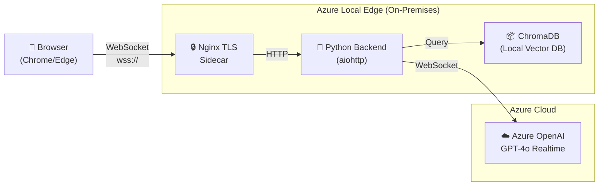

# Dunkin' Donuts AI Voice Ordering — Hybrid Edge Demo

**Azure Local + Azure OpenAI Realtime**

---

## Access

| | |
|---|---|
| **URL** | <https://dunkin.adaptivecloudlab.com> |
| **TLS** | Self-signed certificate — accept the browser warning |
| **Browser** | Chrome or Edge (microphone access requires HTTPS) |
| **Start** | Click the orange microphone button |

## What This Demo Shows

- **Real-time AI voice ordering** powered by Azure OpenAI GPT-4o Realtime
- **Natural language menu search** using a local vector database (ChromaDB)
- **Drive-through style conversation** with order management
- **Running on Azure Local** infrastructure at the edge

## How It Works

1. The browser captures microphone audio and streams it over a WebSocket to the Python backend (via an nginx TLS sidecar).
2. The backend forwards the audio stream to **Azure OpenAI GPT-4o Realtime**, which performs speech-to-text, reasoning, and text-to-speech in a single connection.
3. When the model needs menu information, it issues a **tool call**. The backend queries **ChromaDB** locally — menu data never leaves the edge.
4. The model's spoken response streams back to the browser in real time while the order panel updates via function call results.

## Key Components

- **Voice Pipeline** — Azure OpenAI Realtime API handles speech-to-text, reasoning, and text-to-speech in one streaming connection (~200 ms latency).
- **Menu Knowledge** — ChromaDB with ONNX MiniLM-L6-v2 embeddings searches the Dunkin' menu locally — no cloud dependency for menu data.
- **Tool Calling** — GPT-4o uses function calling to search the menu, update orders, and calculate totals.
- **Infrastructure** — AKS Arc cluster on Azure Local, managed via Flux GitOps.

## Infrastructure Details

| Component | Detail |
|-----------|--------|
| Platform | Azure Local (on-premises) |
| Kubernetes | AKS Arc v1.32.6 |
| GitOps | Flux v2 (syncs from GitHub) |
| Container | 383 MB slim image |
| TLS | Self-signed (nginx sidecar) |
| Search | ChromaDB + ONNX MiniLM-L6-v2 |
| Voice AI | Azure OpenAI GPT-4o Realtime |

## Try It

1. Open <https://dunkin.adaptivecloudlab.com>
2. Accept the self-signed certificate warning
3. Click the **orange microphone button**
4. Say: *"Can I get a large iced coffee and a glazed donut?"*
5. Watch the order panel update with items and totals
6. Say: *"That's all, thanks!"* to complete the order

## About This Project

Originally built by [@swigerb](https://github.com/swigerb), adapted for hybrid-edge deployment by the Adaptive Cloud Lab team. The project demonstrates how Azure Local enables AI-powered applications at the edge with cloud AI services for voice quality that wouldn't be possible with local-only inference.

The fully-local mode (Foundry Local + Whisper + Piper TTS) is also available by setting `USE_LOCAL_PIPELINE=true`, but has higher latency (~10–20 s per interaction) due to edge compute constraints.

---

*Source: [mgodfre3/dunkin-chat-voice-assistant](https://github.com/mgodfre3/dunkin-chat-voice-assistant)*
