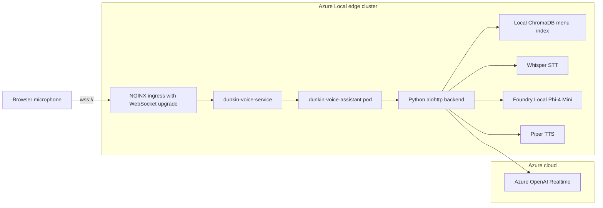

# Dunkin' Donuts AI Voice Ordering Demo Guide

This guide is written for live demos where you want to explain not just the user experience, but what is happening on the edge, what stays local, and how Foundry Local fits into the fully-local option.

If you need a shorter presenter-focused version, use [demo-cheat-sheet.md](demo-cheat-sheet.md). If you need a dedicated fully-local diagram, use [foundry-local-architecture.md](foundry-local-architecture.md).

## Demo URL

| Item | Value |
|---|---|
| Guest experience | <https://dunkin.adaptivecloudlab.com> |
| Employee dashboard | <https://dunkin.adaptivecloudlab.com/crew> |
| Browser | Edge or Chrome |
| TLS | Self-signed certificate, so accept the warning |

## What This Demo Proves

This demo is useful because it shows three things at once:

1. A real-time voice ordering experience that feels like a drive-thru, not a chatbot.
2. An edge architecture where menu data, retrieval, app logic, and cluster runtime stay local on Azure Local.
3. A split between a production-ready hybrid path and a fully-local path that uses Foundry Local, Whisper, and Piper when cloud dependency needs to be minimized.

## The Important Framing

There are two ways this app can run:

| Mode | `USE_LOCAL_PIPELINE` | Speech to text | LLM | Text to speech | Menu retrieval | Typical latency |
|---|---|---|---|---|---|---|
| Hybrid default | `false` | Azure OpenAI Realtime | Azure OpenAI Realtime | Azure OpenAI Realtime | Local ChromaDB at edge | ~200 ms |
| Fully-local | `true` | Whisper at edge | Foundry Local Phi-4 Mini at edge | Piper at edge | Local ChromaDB at edge | ~10-20 s |

The currently deployed public demo is set up to emphasize the hybrid path. That is the stronger live experience because voice feels immediate, but the edge story is still real because retrieval, app logic, containers, and Kubernetes runtime stay on Azure Local.

## Architecture You Can Explain On One Slide


```mermaid
graph LR
    Browser["Browser microphone"] -->|wss://| Ingress["NGINX ingress with WebSocket upgrade"]
    Ingress --> Service["dunkin-voice-service"]
    Service --> Pod["dunkin-voice-assistant pod"]
    Pod --> App["Python aiohttp backend"]
    App --> Chroma["Local ChromaDB menu index"]
    App --> Hybrid["Azure OpenAI Realtime"]
    App --> LocalSTT["Whisper STT"]
    App --> LocalLLM["Foundry Local Phi-4 Mini"]
    App --> LocalTTS["Piper TTS"]

    subgraph Edge["Azure Local edge cluster"]
        Ingress
        Service
        Pod
        App
        Chroma
        LocalSTT
        LocalLLM
        LocalTTS
    end

    subgraph Cloud["Azure cloud"]
        Hybrid
    end
```

The short version is:

1. The browser streams microphone audio over a WebSocket.
2. Kubernetes ingress preserves the upgrade headers so the realtime stream stays open.
3. The backend decides whether to use the hybrid voice stack or the fully-local voice stack.
4. In both cases, menu retrieval and order state stay local.
5. The response comes back as streamed audio and the order panel updates through tool calls.

## What Actually Runs At The Edge

For a live demo, this table gives you a simple way to explain what is local versus what is remote.

| Component | Where it runs | What it does | What to say in the demo |
|---|---|---|---|
| Browser UI | User device | Captures mic audio and plays streamed speech | The browser is just the microphone and speaker endpoint |
| NGINX ingress | Azure Local | Terminates HTTPS and preserves WebSocket upgrades | This is what makes realtime voice stable through the cluster edge |
| `dunkin-voice-assistant` container | Azure Local | Main Python backend and business logic | This is the orchestration layer for the whole voice flow |
| ChromaDB data in the app container | Azure Local | Semantic menu search using local embeddings | Menu knowledge stays on-prem and does not need cloud search |
| Drive-thru simulator and CRM logic | Azure Local | Powers dashboard behavior, vehicle flow, and personalization | This is how we show an operational demo, not just a chat window |
| Azure OpenAI Realtime | Cloud in hybrid mode | Handles speech-to-text, reasoning, and text-to-speech in one stream | Hybrid mode maximizes voice quality and responsiveness |
| Whisper STT | Azure Local in fully-local mode | Converts audio to text | Local fallback for air-gapped or cloud-constrained scenarios |
| Foundry Local model endpoint | Azure Local in fully-local mode | Runs Phi-4 Mini for reasoning and tool use | This is the local LLM path |
| Piper TTS | Azure Local in fully-local mode | Turns text back into audio | Completes the local voice loop |

## Why WebSocket Support Matters

If someone asks why this is more than a normal web app, the answer is that voice depends on a long-lived bidirectional stream. The cluster has to preserve upgrade headers end to end.

The ingress is explicitly configured for that:

- `proxy_http_version: 1.1`
- `Upgrade` and `Connection: upgrade` headers
- long read and send timeouts for persistent voice sessions

That is the difference between a realtime voice app and a simple request-response site.

## Hybrid Mode: What Happens During The Live Demo

This is the path you should narrate for the public deployment.

1. The guest clicks the orange microphone button.
2. The browser opens a secure WebSocket to `/realtime`.
3. Ingress and the service route the traffic to the `dunkin-voice-assistant` pod.
4. The Python backend creates a session and forwards the stream to Azure OpenAI Realtime.
5. The model decides when to call tools such as menu search, update order, or get order.
6. Tool execution happens in the backend against local state and local ChromaDB.
7. The model response streams back as audio while the cart panel updates in parallel.

The important demo line is: voice can use the cloud for speed, but the business data plane is still at the edge.

## Fully-Local Mode: How Foundry Local Fits In

Fully-local mode is enabled by setting `USE_LOCAL_PIPELINE=true`. In that path the backend switches from `RTMiddleTier` to `RTLocalPipeline`.

The local sequence becomes:

1. Browser audio reaches the same backend endpoint.
2. The backend buffers PCM audio and performs basic voice activity detection.
3. Audio is posted to Whisper using `/v1/audio/transcriptions`.
4. The transcript plus conversation state is sent to the Foundry Local endpoint using `/v1/chat/completions`.
5. If Phi-4 Mini issues tool calls, the backend executes them locally.
6. Final text is sent to Piper using `/v1/audio/speech`.
7. The backend streams synthesized audio back to the browser.

That means Foundry Local is not handling raw browser audio directly. It is the local reasoning engine in the middle of a local speech pipeline.

## Foundry Local In Particular

If you want to spotlight Foundry Local, focus on these points:

| Topic | Detail |
|---|---|
| Operator model | Foundry Local is installed as a Kubernetes operator in the `foundry-local-operator` namespace |
| Deployed model | `Phi-4-mini-instruct-cuda-gpu` version `5` |
| Deployment name | `phi-4-mini-gpu` |
| Compute | GPU-backed model deployment |
| Endpoint used by app | `http://phi-4-mini-gpu.foundry-local-operator.svc:5000` |
| OpenAI-compatible path | `/v1/chat/completions` |
| Role in system | Local reasoning engine for the fully-local pipeline |

A good narration is: Foundry Local gives us a cluster-native way to host the model close to the app, expose it behind a service, and swap the cloud reasoning path for a local one without changing the browser experience.

## Containers And Services To Show Live

If you have terminal access to the cluster, these are the most useful things to show.

### Current workload inventory

| Workload | Type | Current role |
|---|---|---|
| `dunkin-voice-assistant` | App deployment | Main backend that handles sessions, tools, ChromaDB access, and mode switching |
| `dunkin-voice-service` | ClusterIP service | Internal service fronting the backend |
| NGINX ingress | Ingress resource | TLS entry point and WebSocket-aware routing |
| `phi-4-mini-gpu` | Foundry Local `ModelDeployment` | Optional local LLM endpoint for fully-local mode |
| `whisper-stt` | Optional deployment and service | Local speech-to-text for fully-local mode |
| `piper-tts` | Optional deployment and service | Local text-to-speech for fully-local mode |

If you want to talk about concrete artifacts, the repo currently points at these runtime images or model packages:

| Component | Runtime image or model |
|---|---|
| Main app | `cadunkinacr.azurecr.io/dunkin-voice-assistant:latest` |
| Whisper STT | `fedirz/faster-whisper-server:latest-cuda` |
| Piper TTS | `kamilkrawiec/piper-openai-tts:latest` |
| Foundry Local model | `Phi-4-mini-instruct-cuda-gpu` version `5` |

One useful nuance for the demo: the current Flux app kustomization is hybrid-first. `USE_LOCAL_PIPELINE` is set to `false`, and the `whisper-stt` and `piper-tts` resources are commented out in the app kustomization, so you should present them as the optional fully-local path rather than the active public deployment.

### Core app and ingress

```bash
kubectl get pods -n dunkin-voice
kubectl get svc -n dunkin-voice
kubectl get ingress -n dunkin-voice
kubectl logs deploy/dunkin-voice-assistant -n dunkin-voice -c dunkin-voice --tail=100
```

What to say:

- The main pod runs the Python backend.
- The service fronts the application inside the cluster.
- The ingress is configured specifically for realtime WebSocket traffic.
- The logs are where you can show session creation and backend activity.

### Foundry Local model deployment

```bash
kubectl get modeldeployments -n foundry-local-operator
kubectl describe modeldeployment phi-4-mini-gpu -n foundry-local-operator
kubectl get pods -n foundry-local-operator
```

What to say:

- This is the local model inventory.
- The model is deployed as a Kubernetes resource, not as a manually managed VM process.
- The app reaches it through an internal service name.

### Optional local speech services

These are useful when you want to prove the fully-local path exists even if you are not using it for the public demo.

```bash
kubectl get deploy,svc -n dunkin-voice | findstr whisper
kubectl get deploy,svc -n dunkin-voice | findstr piper
```

What to say:

- Whisper handles local transcription.
- Piper handles local speech synthesis.
- Those services are separate from the core app so the pipeline is modular.

## Models You Can Talk About

There are really three different model stories in this repo.

| Model or embedding | Used for | Where |
|---|---|---|
| Azure OpenAI `gpt-4o-realtime-preview` | Hybrid speech-to-text, reasoning, and text-to-speech | Cloud |
| Foundry Local `Phi-4-mini-instruct-cuda-gpu:5` | Fully-local reasoning and tool use | Edge |
| `Systran/faster-whisper-small` | Fully-local speech-to-text | Edge |
| Piper voice such as `en_US-amy-medium` | Fully-local text-to-speech | Edge |
| ONNX MiniLM L6 v2 | Local menu embeddings for ChromaDB retrieval | Edge |

The clean demo message is: hybrid mode uses the cloud model for the live voice path, while the fully-local stack proves that the same experience can be assembled from edge-hosted speech and language components.

## What Stays Local Even In Hybrid Mode

This point is often the most important for edge conversations.

Even when the voice path is using Azure OpenAI Realtime, these things still stay local:

- the application container and session logic
- the menu vector store and embeddings
- tool execution for order updates and totals
- the drive-thru simulator and employee dashboard backend
- the Kubernetes runtime, networking, ingress, and GitOps deployment model

So hybrid mode is not a thin client to the cloud. It is an edge application with a cloud voice and reasoning dependency.

## Employee Command Deck

Open <https://dunkin.adaptivecloudlab.com/crew> next to the guest experience so you can show the operational side of the demo while the order conversation is happening.

### Running the employee dashboard locally

1. From `app/employee-dashboard`, run `npm install && npm run dev`.
2. Open the dev server in a browser tab alongside the guest experience.
3. Use the Demo Controls to start, pause, reset, or add cars while you narrate the store workflow.

## Good Live Demo Sequence

If you want a stronger technical story, run the demo in this order:

1. Open the guest experience and employee dashboard side by side.
2. Explain that the cluster is on Azure Local and the UI is talking to an edge-hosted backend.
3. Show the ingress or pod list briefly so the audience sees this is containerized.
4. Place a simple order by voice and let the audience hear the realtime response.
5. Point out that the order panel changed because the model called backend tools, not because the UI guessed.
6. Explain that menu retrieval came from local ChromaDB, not a cloud search index.
7. If you have cluster access, show the Foundry Local model deployment and explain that setting `USE_LOCAL_PIPELINE=true` swaps the reasoning path to Phi-4 Mini.
8. Close by explaining why hybrid is used for the live experience: better latency and speech quality, with the edge data plane still intact.

## Questions You Are Likely To Get

### Why not run everything locally all the time?

Because the hybrid path has much better interaction quality today. Azure OpenAI Realtime gives a smoother speech loop and lower latency, while the fully-local path is useful when you need local model hosting or reduced cloud dependency.

### What is the value of Foundry Local here if the public demo is hybrid?

It shows the architecture is not locked into one cloud-only reasoning path. The backend already supports a local LLM endpoint, and that makes the demo stronger for disconnected, sovereign, or regulated environments.

### What is the edge data story?

Menu retrieval, order state, and most application logic stay on Azure Local. The hybrid dependency is specifically the voice-and-reasoning stream.

### Is this one big container?

No. The main app is one containerized service, but the broader solution is a set of Kubernetes-managed services: ingress, app, optional Whisper, optional Piper, and a Foundry Local model deployment.

## Try It

1. Open <https://dunkin.adaptivecloudlab.com>.
2. Accept the self-signed certificate warning.
3. Click the orange microphone button.
4. Say, "Can I get a large iced coffee and a glazed donut?"
5. Watch the order panel update with items and totals.
6. Say, "That's all, thanks!"
7. Keep the employee dashboard open if you want to narrate the lane and crew view in parallel.

## Useful Repo References

- Hybrid versus local mode is described in [README.md](../README.md).
- The demo app chooses `RTMiddleTier` or `RTLocalPipeline` in [app/backend/app.py](../app/backend/app.py).
- The local speech and LLM pipeline is implemented in [app/backend/rtmt_local.py](../app/backend/rtmt_local.py).
- The Foundry Local model deployment is defined in [flux/apps/foundry-models/phi4-mini-deployment.yaml](../flux/apps/foundry-models/phi4-mini-deployment.yaml).
- The hybrid deployment settings live in [flux/apps/dunkin-voice/configmap.yaml](../flux/apps/dunkin-voice/configmap.yaml).
- WebSocket ingress behavior is defined in [flux/apps/dunkin-voice/ingress.yaml](../flux/apps/dunkin-voice/ingress.yaml).

## Short Demo Script

If you need a tight one-minute version, use this:

"This is a voice ordering assistant running on Azure Local. The browser opens a realtime WebSocket into a Kubernetes-hosted backend at the edge. In the deployed demo, voice uses Azure OpenAI Realtime for low-latency speech and reasoning, but menu retrieval and order logic stay local in the cluster using ChromaDB and backend tools. We also support a fully-local pipeline where Whisper handles transcription, Foundry Local hosts Phi-4 Mini for reasoning, and Piper generates speech, which proves the architecture can shift from hybrid to local without changing the front-end experience."
