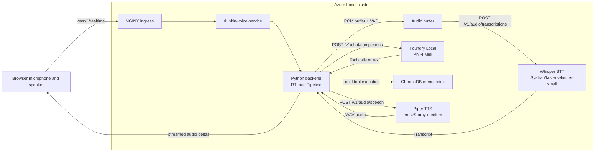

# Foundry Local Architecture

This page isolates the fully-local path so you can explain the Foundry Local story without mixing it with the hybrid deployment.

## Purpose

Use this diagram when the audience specifically wants to understand how the app runs when `USE_LOCAL_PIPELINE=true`.

## Fully-Local Flow

## Step-By-Step Explanation

1. The browser still talks to the same `/realtime` endpoint.
2. The backend switches from the cloud realtime path to `RTLocalPipeline`.
3. Audio is buffered locally and checked with simple voice activity detection.
4. Whisper converts buffered audio into text.
5. The backend sends the transcript and conversation state to the Foundry Local endpoint.
6. Phi-4 Mini can answer directly or issue tool calls.
7. Tool calls execute inside the backend against local order state and local ChromaDB.
8. The final response text goes to Piper, which returns audio.
9. The backend streams that audio back to the browser.

## What Foundry Local Owns

Foundry Local is responsible for the reasoning step in the fully-local path.

| Item | Value |
|---|---|
| Namespace | `foundry-local-operator` |
| Model deployment | `phi-4-mini-gpu` |
| Model catalog entry | `Phi-4-mini-instruct-cuda-gpu` |
| Version | `5` |
| Endpoint pattern | `/v1/chat/completions` |
| App-facing URL | `http://phi-4-mini-gpu.foundry-local-operator.svc:5000` |

## What Foundry Local Does Not Own

Foundry Local is not the browser entry point, not the ingress layer, not the speech-to-text engine, and not the text-to-speech engine. It is the local LLM service in the middle of the speech pipeline.

## Demo Narration

"In fully-local mode, the browser still talks to the same backend. What changes is the voice pipeline behind that backend. Instead of forwarding audio to Azure OpenAI Realtime, the app transcribes locally with Whisper, reasons locally through a Foundry Local-hosted Phi-4 Mini endpoint, executes tools against local state and ChromaDB, and then synthesizes audio locally with Piper. Foundry Local is the LLM serving layer that lets the application keep the reasoning step on the edge." 